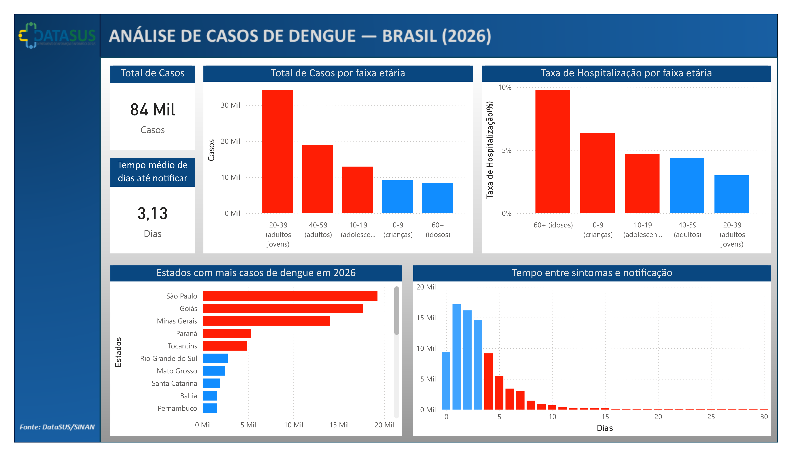

# ETL - Pipeline de Dados de Dengue no Brasil (2026)

Este projeto implementa um pipeline de **ETL (Extract, Transform, Load)** utilizando dados públicos de casos de dengue no Brasil.  
Os dados foram obtidos do **DATASUS** e processados em **Python**, armazenados em **PostgreSQL** e visualizados em **Power BI**.  

O objetivo é demonstrar habilidades práticas em **engenharia de dados, manipulação e integração com bancos relacionais**, simulando um fluxo real de análise epidemiológica.

---

## 📑 Índice
1. [Fonte dos Dados](#fonte-dos-dados)  
2. [Objetivo do Projeto](#objetivo-do-projeto)  
3. [Tecnologias Utilizadas](#tecnologias-utilizadas)  
4. [Principais Transformações](#principais-transformações)  
5. [Dashboard](#dashboard)  

---

## 📊 Fonte dos Dados
- **Origem**: DATASUS — Departamento de Informática do SUS  
- **Dataset**: Casos de dengue no Brasil (2026)  
- **Portal oficial**: [https://datasus.saude.gov.br](https://datasus.saude.gov.br)  

---

## 🎯 Objetivo do Projeto
Construir um pipeline de dados que simule um fluxo real de processamento epidemiológico, incluindo:
- Extração de dados brutos  
- Limpeza e tratamento  
- Engenharia de atributos  
- Armazenamento em banco de dados  
- Preparação para análise  
- Visualização em Power BI para apoio à decisão  

---

## 🛠️ Tecnologias Utilizadas
- **Python** (Pandas, SQLAlchemy)  
- **PostgreSQL / Supabase**  
- **Google Colab**  
- **Git & GitHub**  
- **Power BI**  

---

## 🔄 Principais Transformações
- Renomeação e padronização de colunas  
- Conversão de tipos (datas, idades)  
- Tradução de códigos categóricos via dicionário do DATASUS  
- Conversão de códigos de estado para siglas do IBGE  
- Criação de variáveis derivadas:
  - Dias até notificação  
  - Faixa etária (grupos etários)  
  - Indicador de hospitalização  
  - Taxa de hospitalização por faixa etária  
- Identificação e tratamento de valores nulos e inconsistentes  
- Relatórios automáticos de qualidade de dados com **YData Profiling**  

---

## 📈 Dashboard
Visualização final no Power BI:  

  

O painel mostra a **distribuição de casos**, **tempo de notificação** e **taxa de hospitalização por faixa etária**, permitindo insights sobre vulnerabilidade e eficiência do processo de notificação.

---

## 📌 Observação
Este projeto é de caráter **educacional e demonstrativo**, utilizando dados públicos do DATASUS.  
Não se trata de material oficial do Ministério da Saúde.
